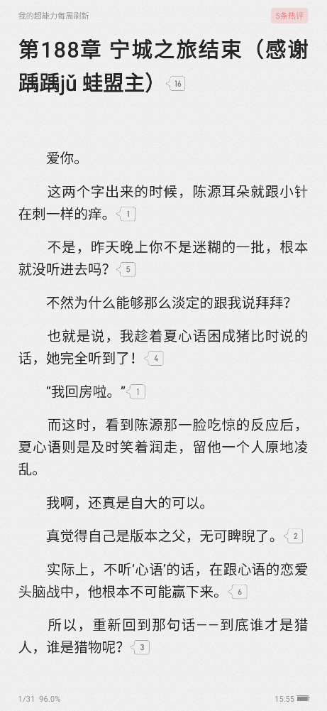

# 起点阅读书籍分享

## 项目简介
    
    该模块可以让用户分享自己已经订阅的章节。
    原理很简单，把订阅的章节上传到服务器，可以让你在没有订阅该章节的情况下，通过其他用户分享的订阅章节来免费观看的订阅内容，和订阅后的体验一致。

## 使用指南

    请入后根据提示先进入我的界面，然后正常观看和订阅。
    如果有分享其他用户分享过的章节会自动展示，不需要再次订阅

## 模块目前问题

 * 首次观看新书可能会卡住，退出起点重进就会恢复

 * 有问题提ISSUES

## 模块目前限制

    同IP最多2个用户、10秒内最多只能请求5次。

    每个用户都能无限制观看其他用户的章节，前提是你在两天之内上传过订阅章节

## 项目目标

    
    模块已经完成了基本的功能，但是还有很多可以改进和优化的地方。

    目前由个人出资垫付了服务器和中转费用，但是只能大概垫付两三个月，我需要大约 100 元/月 的资金来购买和维护服务器。

    如果模块你们用起来很舒服，并且不想项目暴死，请援助我们。

    如果你对我的模块感兴趣，或者想要支持我的创意，你可以选择多多宣传本项目或者以下几种方式来参与我的众筹项目：

    待定...

---

## 预览

